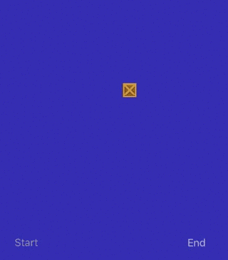
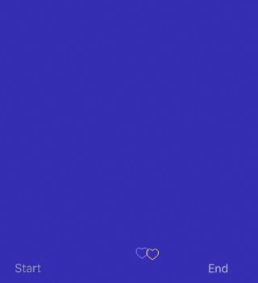
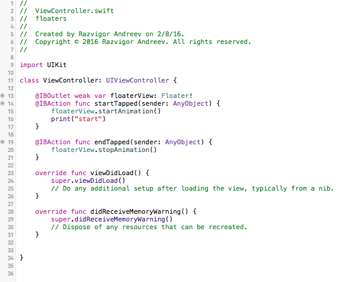
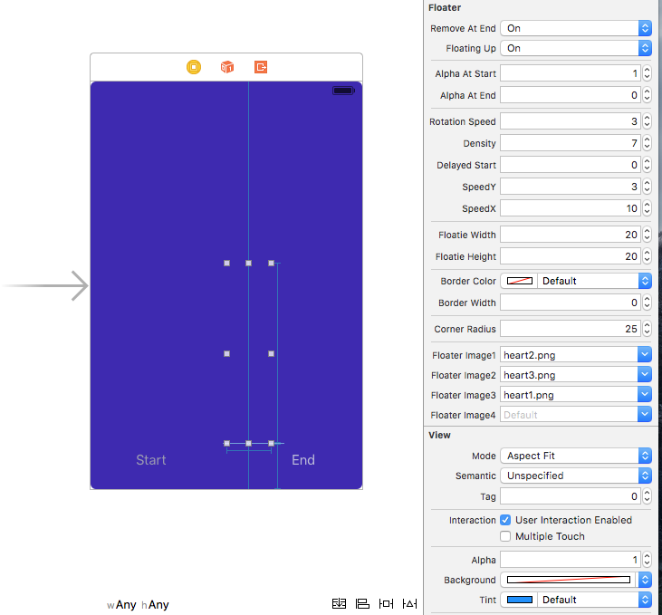

# ios Floaters 

[]()
[]()

Easily add animated icons/emoji/images, similar to the Periscope floating hearts effect.

[  Updated for Swift 4 ]







## Usage

Usage is as easy as:

```Swift
@IBOutlet weak var floaterView: Floater!

@IBAction func startTapped(sender: AnyObject) {
floaterView.startAnimation()
}

@IBAction func endTapped(sender: AnyObject) {
floaterView.stopAnimation()
}

// Change the density like ... ( look at example )
floaterView.density = 25
```

Take a look at the project to see a full example.

## Requirements

* iOS 8 or later
* Xcode 6 or later

## Author
Razvigor Andreev - helpMeCodeSwift @ Twitter
http://helpMeCodeSwift.com

## License

iOS Floaters is available under the MIT license. See the [LICENSE](https://github.com/ravenshore/floaters/blob/master/LICENSE.md) file for more info.
